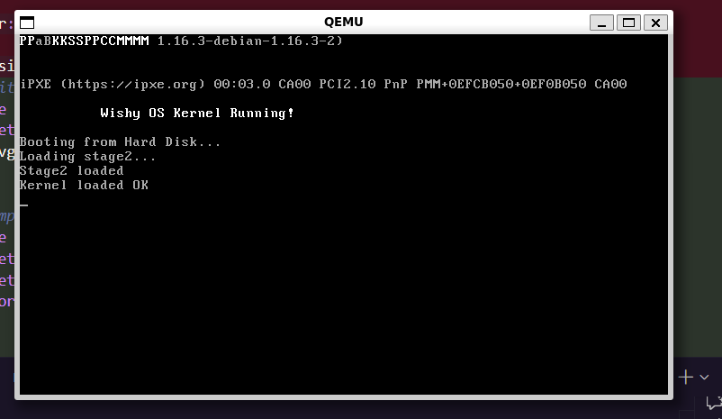

# wishy – x86 Operating System

[](LICENSE)
[]()
[]()

<p align="center">
  
</p>

wishy is an **experimental x86 operating system kernel prototype** focused on
low-level OS development. The project explores bootloaders, kernel bring-up,
memory management, and early userspace infrastructure.

Only features that can be demonstrated are documented. Planned systems are
clearly marked as work in progress.

## Overview

- Installation
- Downloads
- Usage
- Examples
- Architecture
- File Structure

## Downloads

Pre-built disk images are available from the 
[Releases](https://github.com/sahilarun/wishy/releases) page.

To create a new release, push a version tag:
```shell
git tag v0.1.0
git push origin v0.1.0
```

This will trigger the GitHub Actions workflow to build and publish the release
with the bootable disk image.

## Installation

Build from source:

```shell
git clone https://github.com/aprilworks/wishy.git
cd wishy
git checkout dev
make all
```

Prerequisites (Ubuntu / Debian):

```shell
sudo apt install -y nasm gcc build-essential qemu-system-x86 gcc-multilib git
curl --proto '=https' --tlsv1.2 -sSf https://sh.rustup.rs | sh
source $HOME/.cargo/env
rustup toolchain install nightly
rustup default nightly
rustup component add rust-src
```

For detailed setup instructions, see [INSTALLATION.md](INSTALLATION.md).

## Usage

Run the OS using QEMU:

```shell
make run
```

Manual QEMU invocation:

```shell
qemu-system-i386 \
  -drive format=raw,file=build/wishy.img \
  -m 256M \
  -serial stdio \
  -vga std
  ```

wishy is currently intended for QEMU-based development and testing only.

## Examples

Boot output:
```
Wishy OS Kernel Running!
Booting from Hard Disk...
Loading stage2...
Stage2 loaded
Kernel loaded OK
```

This confirms:
- Two-stage bootloader execution
- Kernel loading
- Early kernel initialization

## Project Status

Implemented:
- [x] Two-stage x86 bootloader
- [x] Disk boot under QEMU
- [x] Transition to protected mode
- [x] Kernel entry and initialization
- [x] VGA / serial output
- [x] Early memory setup
- [x] Modular kernel structure

In Progress / Planned:
- ext2 filesystem support
- Virtual File System (VFS)
- ELF userspace loader
- Userspace programs and shell
- Process scheduling
- Linux syscall compatibility layer
- Graphics stack (framebuffer / compositor)
- GPU acceleration
- Networking
- Browser integration

Planned features are not considered complete until demonstrably functional.

## Architecture

High-level execution flow:
```
BIOS / QEMU
  ↓
Stage 1 Bootloader
  ↓
Stage 2 Loader
  ↓
Kernel (Protected Mode)
  ↓
Kernel Subsystems
  ↓
Userspace Infrastructure (WIP)
```

A more detailed breakdown is available in [ARCHITECTURE.md](ARCHITECTURE.md).

## File Structure
```
wishy/
├── boot/          - Assembly bootloader
├── kernel/        - Kernel source (Rust)
│   ├── drivers/   - Hardware drivers (WIP)
│   ├── fs/        - Filesystem code (WIP)
│   ├── gui/       - Graphics / compositor (WIP)
│   ├── compat/    - Linux compatibility layer (WIP)
│   └── wayland/   - Wayland server (experimental)
├── userspace/     - Userspace programs (WIP)
└── rootfs/        - Root filesystem layout
```

## Goals

- Learn real operating system fundamentals
- Build a complete boot-to-userspace pipeline incrementally
- Prefer correctness and clarity over feature count
- Avoid exaggerated or misleading claims

## License

Licensed under the Apache License, Version 2.0. See [LICENSE](LICENSE) for details.